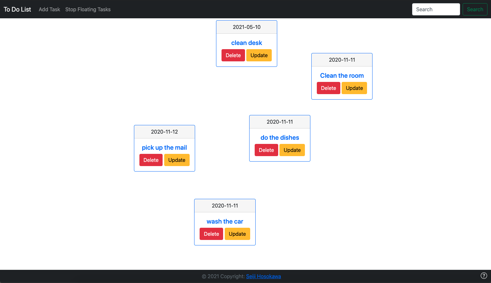

# To Do List App
This is a To Do List App using the Flask framework. I just wanted to get a feel for the Flask framework and so I created a simple to do list application where I can write any thing I need to get done. It allows me to view my to do list, delete any item after I have completed it and update the item if something changes.

This uses Bootstrap HTML, Flask web framework with python backend, SQLite database.

References:
  * https://getbootstrap.com/docs/4.5/getting-started/introduction/
  * https://flask.palletsprojects.com/en/1.1.x/
